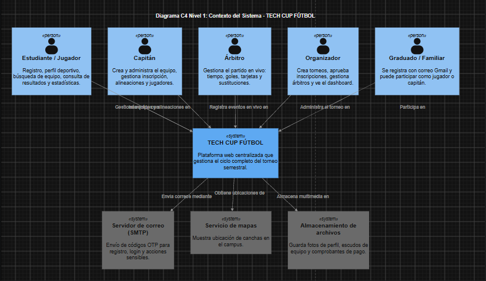

# Bitácora de Planeación Ágil - Taller 6: TECH CUP FÚTBOL
**Rol:** Equipo DOSW (Gestor de Proyecto)  
**Proyecto:** DOSW-TechCup-2026

---

## 1. Diagrama C4 — Nivel 1: Contexto del Sistema
El diagrama de contexto muestra el sistema como una caja negra, los actores que interactúan con él y los sistemas externos de los que depende.

---

## 2. Épica del Proyecto
* **Código:** `TCH-EPIC-01`
* **Nombre:** Plataforma digital TECH CUP FÚTBOL
* **Fechas:** 08/08/2026 (Sprint 1) al 01/10/2026 (Cierre Sprint 7)
* **Problema que resuelve:** El torneo semestral se organiza con WhatsApp, formularios y hojas de cálculo, generando retrasos e inconsistencias.
* **Criterios de éxito:** Gestión completa sin hojas de cálculo, arbitraje en vivo desde celular y cumplimiento de accesibilidad WCAG 2.1 AA.

---

## 3. Backlog y Features Principales
*Los features y sus Historias de Usuario (HU) asociadas en formato Como/quiero/para se detallan en el tablero de Jira del proyecto.*

* **FEAT-01:** Registro e identidad de usuarios (Sprint 1)
* **FEAT-02:** Perfil deportivo y gestión de jugadores (Sprint 2)
* **FEAT-03:** Creación y administración de equipos (Sprint 2)
* **FEAT-04 al FEAT-12:** Módulos de torneos, arbitraje en vivo, estadísticas y llaves eliminatorias (Sprints 3 al 6).
* **Features de Infraestructura (FEAT-INF-01 al FEAT-INF-05):** Configuración de repositorio, manual de identidad visual, Jira y presentación final.

---

## 4. Trazabilidad en Jira
El tablero completo con la jerarquía de Épica, Features, Tareas Técnicas estimadas en Story Points y los 7 Sprints configurados se encuentra disponible en el siguiente enlace del espacio de trabajo:

https://mail-team-xz4atqua.atlassian.net/jira/software/projects/TCHP/boards/35/backlog