# Taller #4 — Patrones de Diseño Combinados (DOSW)

**Asignatura:** Desarrollo de Software (DOSW)
**Institución:** Escuela Colombiana de Ingeniería Julio Garavito
**Estudiante:** Juan Nicolás Álvarez

## Objetivo

Implementar diez ejercicios combinando exactamente dos patrones de diseño. Para cada ejercicio se describe el rol de los patrones, su interacción, la solución implementada y la justificación de su uso.

---

# 01. Plataforma de Pagos Inteligentes

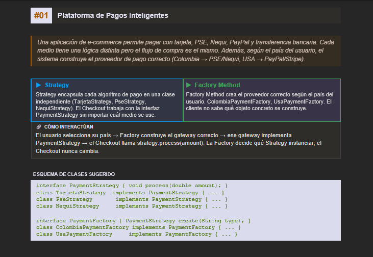

**Patrones:** Strategy + Factory Method

**Rol:** `Strategy` encapsula los diferentes métodos de pago. `Factory Method` crea la estrategia correspondiente según el país y el método seleccionado.

**Interacción:** La fábrica crea un `PaymentStrategy` y `Checkout` ejecuta el pago mediante la interfaz común, sin conocer la implementación concreta.

**Ventaja:** Se evita llenar `Checkout` de condicionales y se separa la creación de la estrategia de la lógica de pago.

---

# 02. Sistema de Notificaciones Multicanal

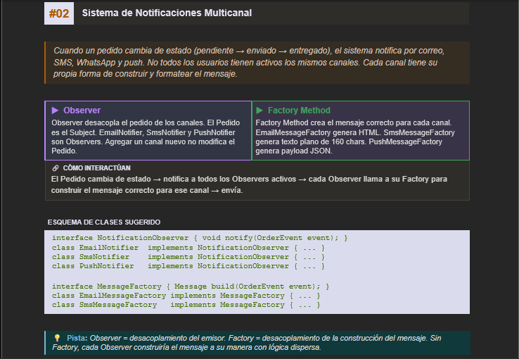

**Patrones:** Observer + Factory Method

**Rol:** `Observer` permite notificar a los canales activos cuando cambia el estado de un pedido. `Factory Method` construye el mensaje con el formato correspondiente a cada canal.

**Interacción:** `Pedido` notifica a los observers y cada uno utiliza su `MessageFactory` para generar el mensaje antes de enviarlo.

**Ventaja:** Se pueden agregar nuevos canales sin modificar `Pedido` y se mantiene separada la lógica de construcción de mensajes.

---

# 03. Sistema de Reportes Empresariales

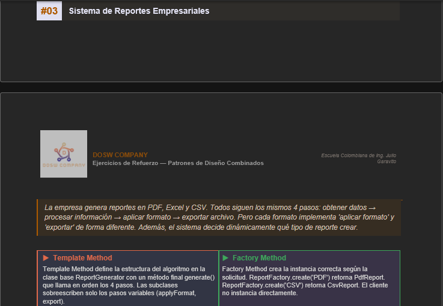

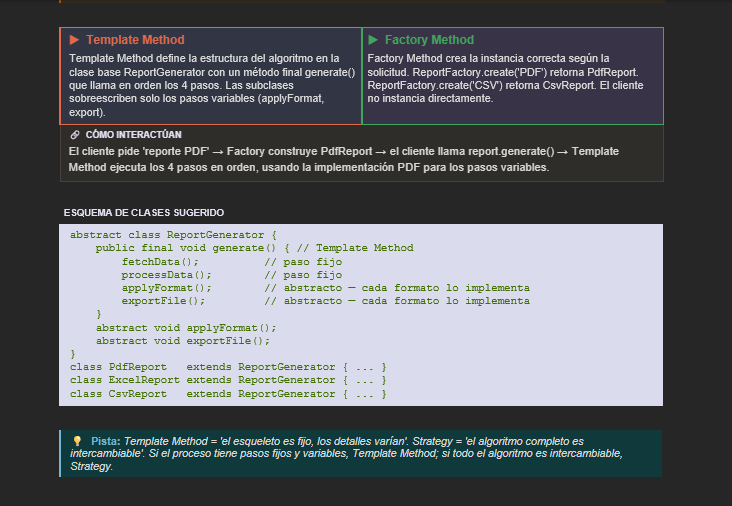

**Patrones:** Template Method + Factory Method

**Rol:** `Template Method` define el flujo fijo de generación del reporte. `Factory Method` crea el tipo de reporte solicitado.

**Interacción:** `ReportFactory` crea `PdfReport`, `ExcelReport` o `CsvReport`. Después, `generate()` ejecuta los cuatro pasos definidos por `ReportGenerator`.

**Ventaja:** El algoritmo común no se duplica y el cliente no necesita instanciar directamente cada tipo de reporte.

---

# 04. Plataforma de Videojuegos — Personajes

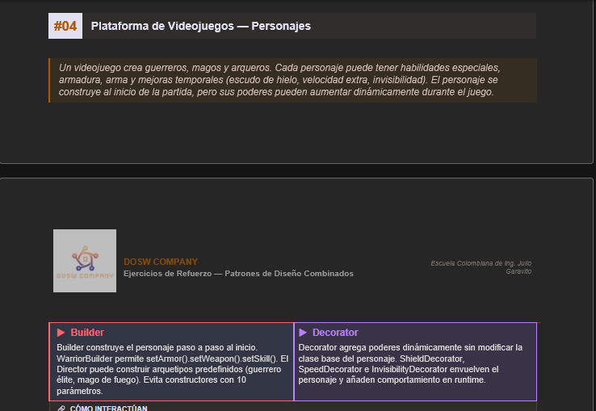

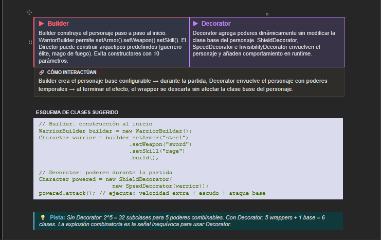

**Patrones:** Builder + Decorator

**Rol:** `Builder` construye el personaje paso a paso. `Decorator` añade poderes temporalmente sin modificar la clase base.

**Interacción:** `WarriorBuilder` crea el personaje y posteriormente se pueden agregar `ShieldDecorator`, `SpeedDecorator` e `InvisibilityDecorator`.

**Ventaja:** Builder evita constructores complejos y Decorator permite combinar poderes sin crear una subclase para cada combinación.

---

# 05. Integración con Sistema Bancario Antiguo

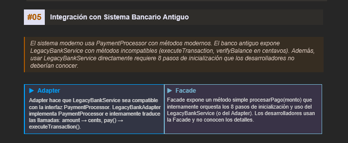

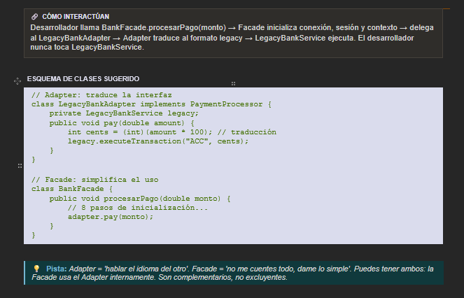

**Patrones:** Adapter + Facade

**Rol:** `Adapter` traduce la interfaz moderna `PaymentProcessor` a la API de `LegacyBankService`. `Facade` oculta los pasos internos necesarios para utilizar el sistema legacy.

**Interacción:** El cliente llama a `BankFacade.procesarPago()`. La fachada realiza la inicialización y delega al adapter, que adapta la operación al sistema antiguo.

**Ventaja:** El código moderno queda desacoplado de la interfaz legacy y de sus detalles de inicialización.

---

# 06. Motor de Recomendaciones

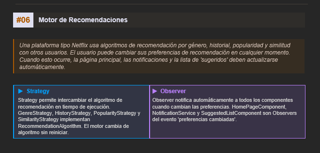

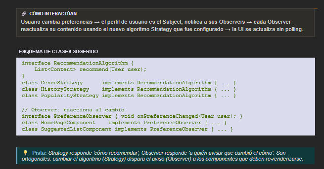

**Patrones:** Strategy + Observer

**Rol:** `Strategy` permite cambiar el algoritmo de recomendación. `Observer` notifica a los componentes cuando cambian las preferencias.

**Interacción:** `UserProfile` recibe una nueva estrategia y notifica a `HomePageComponent`, `NotificationService` y `SuggestedListComponent`, que utilizan el algoritmo actualizado.

**Ventaja:** El algoritmo puede cambiar sin modificar la interfaz y los componentes no dependen directamente de la lógica interna del perfil.

---

# 07. Flujo de Aprobación de Documentos

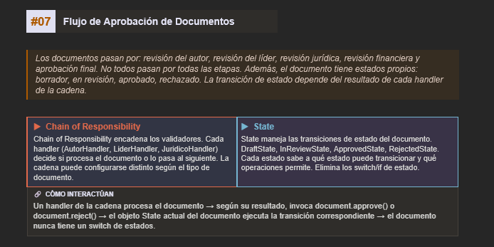

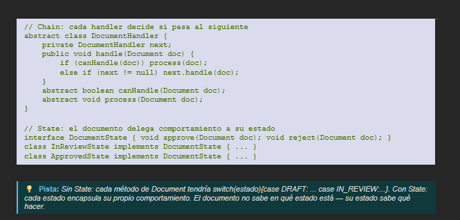

**Patrones:** Chain of Responsibility + State

**Rol:** `Chain of Responsibility` organiza las diferentes etapas de revisión. `State` controla las transiciones entre borrador, revisión, aprobado y rechazado.

**Interacción:** Cada handler procesa una etapa y decide si continúa o rechaza el documento. El estado del documento cambia según el resultado.

**Ventaja:** Las etapas pueden modificarse o reorganizarse fácilmente y las reglas de cada estado permanecen encapsuladas.

---

# 08. Sistema de Pedidos en Restaurante

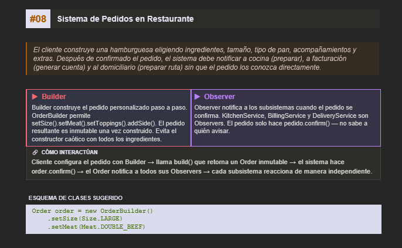

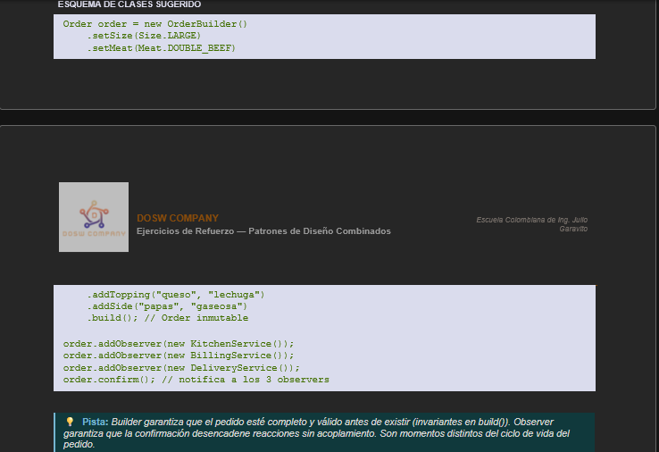

**Patrones:** Builder + Observer

**Rol:** `Builder` construye el pedido paso a paso. `Observer` notifica a los subsistemas cuando el pedido es confirmado.

**Interacción:** `OrderBuilder` construye un `Order` inmutable y, al ejecutar `confirm()`, se notifica a `KitchenService`, `BillingService` y `DeliveryService`.

**Ventaja:** Se evita un constructor complejo y `Order` no queda acoplado directamente a los diferentes subsistemas.

---

# 09. Sistema de Autenticación Empresarial

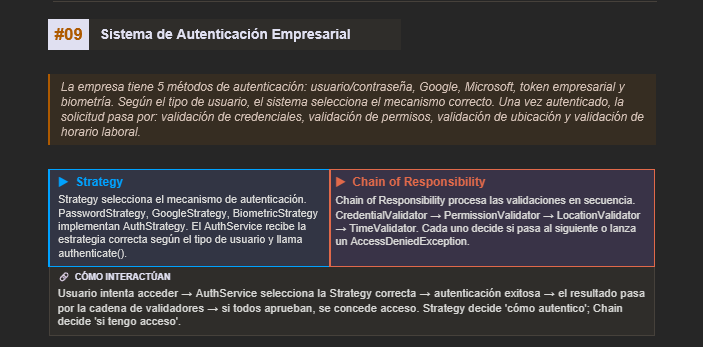

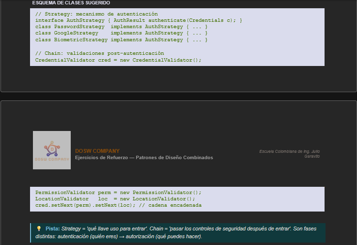

**Patrones:** Strategy + Chain of Responsibility

**Rol:** `Strategy` selecciona el mecanismo de autenticación. `Chain of Responsibility` procesa las validaciones posteriores.

**Interacción:** `AuthService` utiliza una estrategia de autenticación y, si tiene éxito, envía la solicitud a la cadena de validadores.

**Ventaja:** El mecanismo de autenticación puede cambiar independientemente de las validaciones de seguridad y se pueden añadir nuevos validadores a la cadena.

---

# 10. Aplicación de Edición de Imágenes

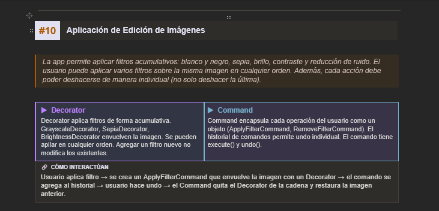

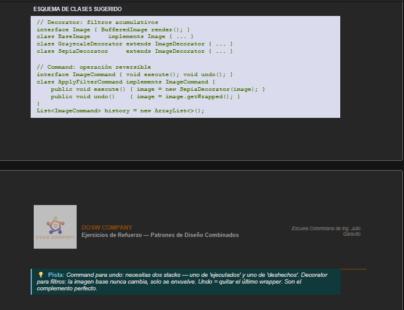

**Patrones:** Decorator + Command

**Rol:** `Decorator` permite combinar filtros sobre la imagen. `Command` encapsula cada operación y permite ejecutarla, deshacerla y rehacerla.

**Interacción:** Cada filtro se añade mediante un `ApplyFilterCommand`. El editor mantiene los comandos y puede activar o desactivar un filtro específico.

**Ventaja:** Los filtros pueden combinarse sin crear múltiples subclases y las operaciones quedan encapsuladas para controlar su historial.

